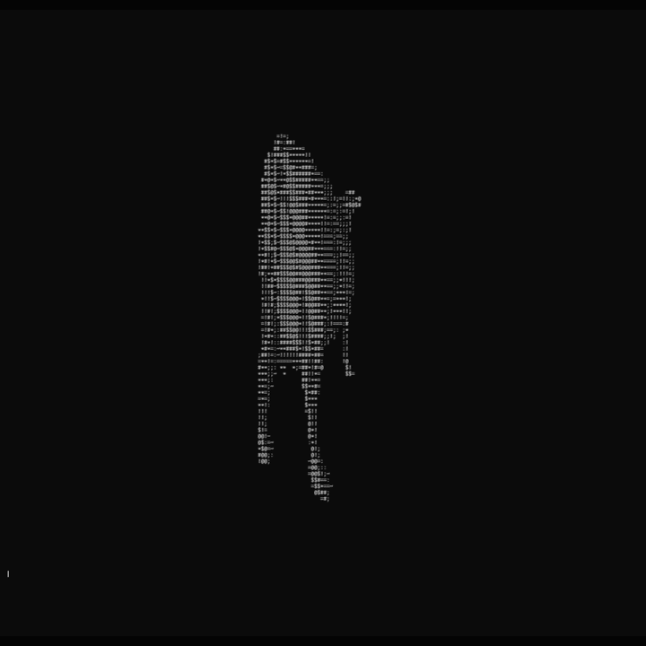

# ASCII Rasterizer
A CPU-based 3D rasterizer that runs in the terminal. Heavily inspired by donut.c. Able to load .obj files using a custom loader.




## Usage
Run the following commands to run the rasterizer:
```
cargo build
cargo run -- --scale 0.1 --fov 30 --model-path 'path/to/model.obj'
```

## Controls
WASD - Player Movement
Arrow keys - Camera Movement

## Examples 

